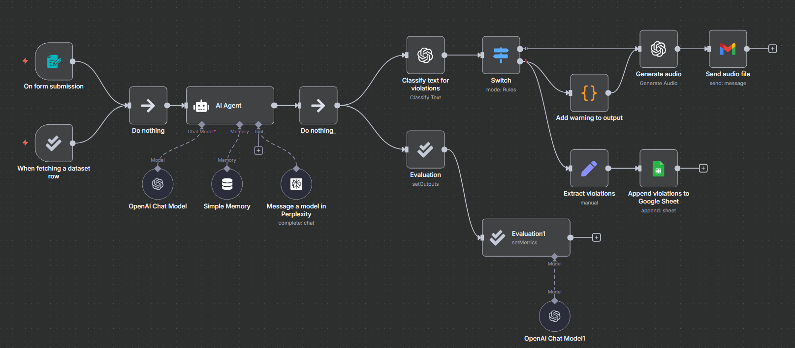

  <h1>ARIA: Audio Research & Intelligence Assistant</h1>
ARIA is an automated research assistant built in n8n. It fetches academic data with Perplexity AI, summarizes with OpenAI, checks for safety issues, converts results to audio, and emails them to users, while logging any policy violations.

  

## Problem
Manually researching a topic means opening dozens of browser tabs, reading papers from different sources, and synthesizing the information yourself. It's time-consuming and often repetitive. 

ARIA will be useful for:

* Researchers – Saves time scanning dozens of papers.
* Students – Makes academic research easier to understand and listen to on the go.
* Institutions – Keeps track of flagged or sensitive content for compliance.

## Demo Link

Available upon request (contact me to see ARIA in action)

  

## Features

*   **User-Friendly Input:** Submit research topics through a simple form interface.
*   **Academic Source Retrieval:** Fetches data from reputable sources (arXiv, PubMed, etc.) using the Perplexity API.
*   **AI-Powered Summarization:** Uses OpenAI's GPT models to create clear, conversational, and objective summaries.
*   **Content Safety Check:** Automatically classifies generated text for safety policy violations using OpenAI's Moderation endpoint.
*   **Audio Narration:** Converts the final research summary into spoken audio (MP3) for easy consumption.
*   **Smart Routing:** Flags and prepends warnings to summaries that have content violations.
*   **Violation Logging:** Extracts and logs details of any flagged content to a Google Sheet for review.
*   **Modular Design:** Easy to customize and extend.

## Workflow Overview
 

1.  **Trigger:** The workflow is initiated by submitting an n8n form.
2.  **Perplexity Node:** The user's query is sent to Perplexity AI to retrieve information from academic sources.
3.  **OpenAI Summarization:** The retrieved context is sent to OpenAI to generate a structured, audio-optimized summary.
4.  **Content Moderation:** The summary is checked against OpenAI's moderation API.
5.  **Switch Node:** Routes the workflow based on if the content was flagged.
    *   **Clean Path:** Continues normally.
    *   **Flagged Path:** Extracts violation categories, logs them to Google Sheets, and prepends a warning to the summary.
6.  **Audio Generation:** The summary text is converted to an MP3 audio file.
7.  **Email Delivery:** The audio file and summary text are sent to the user's email address.
   
## Requirements

*   An n8n account [n8n Cloud](https://n8n.io/)
*   API Keys for:
    *   [OpenAI](https://platform.openai.com/api-keys)
    *   [Perplexity AI](https://www.perplexity.ai/settings/api)
*   Google Service Account Credentials (for Sheets logging)
*   An SMTP Email Account (e.g., Gmail) for sending results
  
## Usage

1.  **Activate the workflow** by submitting the topic and time period to focus the search on via the search form.
    *   The workflow will run automatically.
2.  **Receive Output:** Check your email for a message containing:
    *   The researched summary in the body.
    *   The narrated audio file (MP3) as an attachment.
3.  **Review Logs:** If the content was flagged, the violation categories will be logged in your configured Google Sheet.

## Tech Stack

| Component | Technology |
| :--- | :--- |
| **Workflow Automation** | n8n |
| **LLM Summarization** | OpenAI GPT Models |
| **Academic Retrieval** | Perplexity AI |
| **Content Moderation** | OpenAI Moderation API |
| **Audio Generation** | OpenAI Text-to-Speech (TTS) |
| **Data Logging** | Google Sheets API |
| **Delivery** | SMTP (Gmail) |

## Customization

*   **Change Output:** Replace the Email node with a node for a database to store results elsewhere.
*   **Modify Prompt:** Edit the "System Prompt" in the OpenAI node to change the tone, length, or structure of the summaries.
*   **Adjust Sources:** Add more tools besides the Perplexity tool to focus the search on specific sources for different domains.
